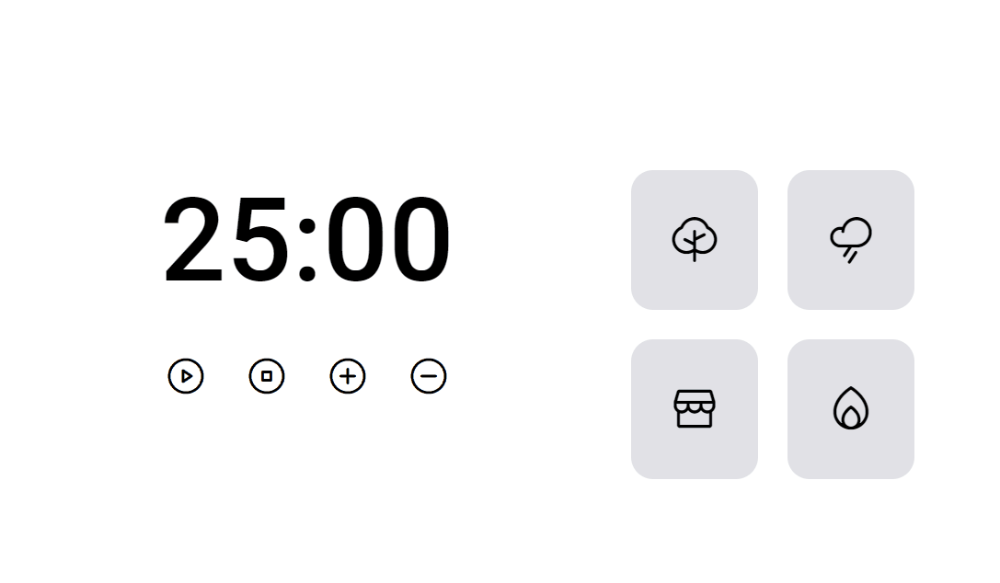

# FocusTimer2
A focus timer using Javascript, CSS and HTML, with sound buttons, including musics for concentration.

I used multiple javascript techiniques, mostly changing HTML classes to do certain aspects of my project, like:
- A play and stop button
- An increase 5 minutes and a decrease 5 minutes button
  
- Buttons with sounds for concentration, including:
  
* Coffee Shop music
* Fireplace noise
* Rain noise
* Forest noises

The project is available at: [https://focus-timer2-three.vercel.app/](https://focus-timer2-three.vercel.app/)

  

